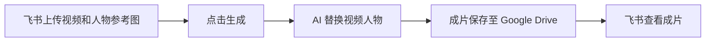

# 飞书视频换人物工作流

在飞书表格中上传视频和 3 张人物参考图，一键发起视频人物替换，自动将成片保存至 Google Drive，并回填观看链接。

## 运行路径



你在飞书表格中管理素材和结果，n8n 负责串联任务，视频 Worker 负责调用 Gemini 处理视频。

## 主要功能

- **在表格中完成操作：**上传素材、提交任务、查看状态和成片链接。
- **只需要 3 张人物参考图：**用目标人物的照片指导视频中的人物外观替换。
- **自动保存与回填：**成片上传 Google Drive，观看链接自动写回对应记录。
- **进度与异常反馈：**显示生成状态，校验失败、处理异常或等待超时时给出提示。
- **生成发布文案和标签：**AWS 方案可请求兼容的 Worker 生成中文文案与标签，回填至表格。

## 运行方式

| 方案 | 适合谁 | 需要准备 | 工作流文件 |
| --- | --- | --- | --- |
| 本地版 | 希望先在自己电脑上使用的人 | Python Worker、可供 n8n 访问的 HTTPS 地址，例如 ngrok | [local.json](workflows/local.json) |
| AWS 版 | 已有兼容云端 Worker 的人 | 已部署的 Worker、服务地址和访问凭证 | [aws.json](workflows/aws.json) |

仓库提供[本地 Worker 源码](worker/)。AWS 版需要自备兼容云端服务，仓库不包含云端 Worker 实现。两套方案都需要 n8n、飞书应用和 Google Drive 授权。

本地版使用 9 秒分段，不生成发布文案；AWS 工作流沿用 10 秒分段、720p 和中文文案参数。请分别连接对应服务，不要将本地 Worker 直接当作 AWS 版的后端。

## 快速开始

### 1. 创建飞书多维表格

按下面的字段准备表格。字段名需与工作流一致。

| 字段 | 类型 | 用途 |
| --- | --- | --- |
| 序号 | 自动编号或数字 | 标识记录 |
| 模板视频 | 附件 | 上传需要替换人物的视频 |
| 人物参考图 | 附件 | 上传目标人物的参考照片 |
| 人物性别 | 单选：女、男 | 用于人物外观提示词 |
| 生成视频 | 按钮 | 发起任务 |
| 状态 | 单选 | 待生成、生成中、已完成、失败 |
| 输出视频 | 超链接 | 查看 Google Drive 成片 |
| 错误信息 | 多行文本 | 查看失败或异常提示 |
| post_content | 多行文本 | AWS 版回填发布文案 |
| tags | 文本 | AWS 版回填标签 |

当前工作流通过飞书知识库节点定位表格，需要将多维表格放在知识库中，并让飞书应用获得对应访问权限。完整设置见[飞书表格模板说明](docs/飞书表格模板.md)。

### 2. 准备 Worker

**使用本地版：**将 `worker/.env.example` 复制为同目录的 `.env`，填入自己的 Gemini API Key 和 Worker Key，然后安装依赖并启动服务：

```sh
cd worker
python3 -m venv .venv
.venv/bin/python -m pip install -r requirements.txt
.venv/bin/python worker.py
```

需要 Python 3.10+。以上命令适用于 macOS/Linux；macOS 也可以使用 `start_worker.command` 启动。再通过 ngrok 等工具提供 HTTPS 地址，供 n8n 访问。

**使用 AWS 版：**准备已有兼容 Worker 的 HTTPS 根地址及访问密钥。所需接口见[配置与上线说明](docs/配置与上线.md#aws-接口边界)。

### 3. 导入 n8n 工作流

将 `workflows/local.json` 或 `workflows/aws.json` 导入 n8n。在 `CONFIG1` 中填写知识库节点标识、表格 ID、Worker 地址和 Google Drive 文件夹 ID，再绑定下一节列出的凭证。

工作流默认未启用，需完成配置和测试后再启用。

### 4. 连接飞书“生成视频”按钮

为按钮配置“发送 HTTP 请求”自动化：

- **方法：**POST。
- **URL：**n8n Webhook 节点显示的地址；测试时使用测试地址，上线后使用生产地址。
- **请求头：**`Content-Type: application/json`，以及与 n8n 入口凭证一致的 `X-Webhook-Key`。
- **请求体：**如下，将占位文字替换为飞书变量选择器中的“当前记录 ID”。

```json
{
  "record_id": "当前记录的记录ID"
}
```

这里使用的是飞书内部记录 ID，不是表格中的“序号”。

### 5. 生成第一条视频

新建一条测试记录，上传模板视频和 3 张人物参考图，选择人物性别，点击“生成视频”。状态变为“已完成”后，通过“输出视频”打开成片。

第 1 张参考图作为主要外观依据，后续图片辅助提供角度和体态信息。实现接受 1–3 张参考图；每条记录只读取第一个模板视频。AWS 版的文案与标签由兼容 Worker 返回，本地版不填写这两列。

## 需要配置什么

| 配置项 | 在哪里填写 | 用途 |
| --- | --- | --- |
| 飞书 App ID、App Secret | n8n 的 Custom Auth 凭证 | 读取和更新表格、获取素材 |
| 知识库节点标识、表格 ID | 工作流 `CONFIG1` | 定位使用的飞书表格 |
| 入口密钥 `X-Webhook-Key` | n8n Webhook 的 Header Auth 凭证，以及飞书自动化请求头 | 验证按钮发来的请求 |
| Worker HTTPS 地址 | 工作流 `CONFIG1` | 连接视频处理服务 |
| Worker 密钥 `X-Worker-Key` | n8n 的 Header Auth 凭证，与 Worker 配置保持一致 | 访问任务创建、查询和下载接口 |
| Gemini API Key | 本地版的 `worker/.env`；云端按服务配置 | 调用视频模型 |
| Google Drive 账号授权 | n8n 的 Google Drive OAuth2 凭证 | 上传成片 |
| Google Drive 文件夹 ID | 工作流 `CONFIG1` | 指定成片保存目录 |

飞书入口密钥和 Worker 密钥分别配置。飞书应用凭证还需绑定失败恢复分支中的 `Recovery - Get Token` 节点，确保异常时可以尝试更新表格。

具体凭证格式、节点绑定位置和部署步骤见[配置与上线说明](docs/配置与上线.md)。

## 注意事项

- **先试跑再正式使用。**仓库包含离线回归测试；仍需在自己的 n8n、飞书、Worker 和 Drive 环境中验证完整流程。
- **模型访问与费用。**需要可调用相应 Gemini 视频模型的 API 账号，生成任务可能产生费用。模型名可通过 `GEMINI_VIDEO_MODEL` 配置。默认的 `gemini-omni-flash-preview` 官方计划于 **2026-09-30** 停用，使用前请核对并测试替代模型 `gemini-omni-1.1-flash`。参见 [Google 模型停用计划](https://ai.google.dev/gemini-api/docs/deprecations)。
- **素材与效果。**请使用有权处理和分享的视频及人物照片。生成效果取决于素材质量、人物遮挡、动作和模型表现，发布前应检查成片。
- **音频行为。**本地 Worker 合并原视频音轨；无声视频保持无声。AWS 工作流设置为不生成声音，但最终是否保留原音轨，需要确认所连接的云端 Worker 实现。
- **超时不等于取消。**工作流默认等待最多 100 分钟，超时会停止查询并尝试回写失败，后台任务可能仍在运行。重新提交前先检查任务状态。
- **重复请求。**记录已经处于“生成中”时会跳过再次提交；几乎同时到达的请求仍需要 Worker 的幂等机制防止重复任务。
- **成片观看权限。**Drive 链接不会自动设为公开，分享给他人前需要设置对应文件的观看权限。
- **凭证与运行数据。**不要提交 `.env`、真实密钥或任务素材。默认运行数据保存在 `worker/data/jobs/`，需要自行定期清理。

故障处理、执行上限和上线检查详见[配置与上线说明](docs/配置与上线.md)。
